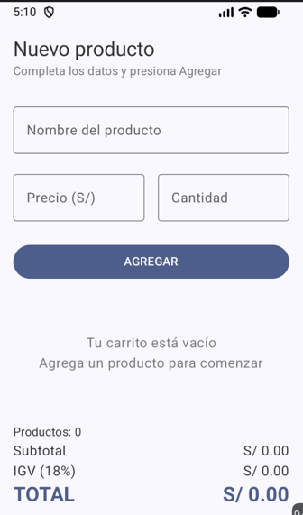

# CARRITO DE COMPRAS - LAZYCOLUMN

**Nombre y apellido**: Leonel Mathias Retamozo De la Cruz

# DESCRIPCIÓN
El programa trata sobre la implementación de un carrito de compras desarrollado en Kotlin con Jetpack Compose. En esta parte se está implementando una lista de productos usando LazyColumn, donde se pueden registrar productos ingresando su nombre, precio y cantidad, además de eliminarlos del carrito. También se está implementando un panel de totales que muestra la cantidad de productos, el subtotal, el IGV y el total de la compra. Finalmente, se está agregando un estado vacío para mostrar un mensaje cuando no hay productos registrados.

# CAPTURAS DE PANTALLA

# PREGUNTA PLANTEADA POR EL DOCENTE
- **¿Por qué mutableStateListOf y no una MutableList normal?**
    - Se usa mutableStateListOf y no una MutableList normal porque permite que Jetpack Compose detecte automáticamente cuando se agregan o eliminan productos y actualice la pantalla. Con una MutableList normal, los cambios en la lista no provocarían una recomposición automáticamente.
- **¿Por qué la lista es val?**
    - La lista es val porque no necesitamos cambiar la referencia de la lista, sino modificar su contenido agregando o eliminando productos. mutableStateListOf permite modificar los elementos aunque la variable esté declarada como val.
- **¿Qué hace weight(1f) en la LazyColumn?**
    -  Hace que la LazyColumn ocupe todo el espacio disponible que queda dentro del Column, permitiendo que el panel de totales quede debajo.