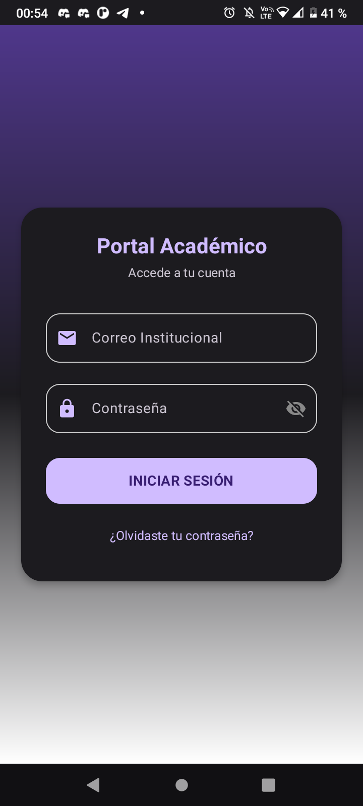
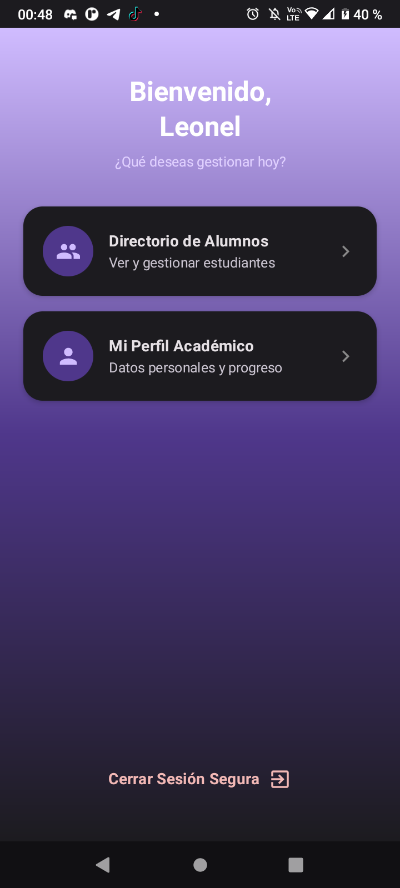
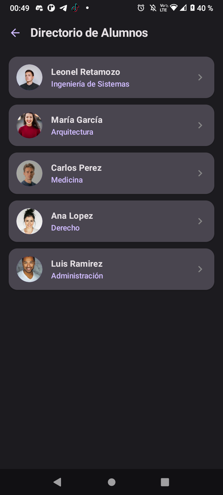
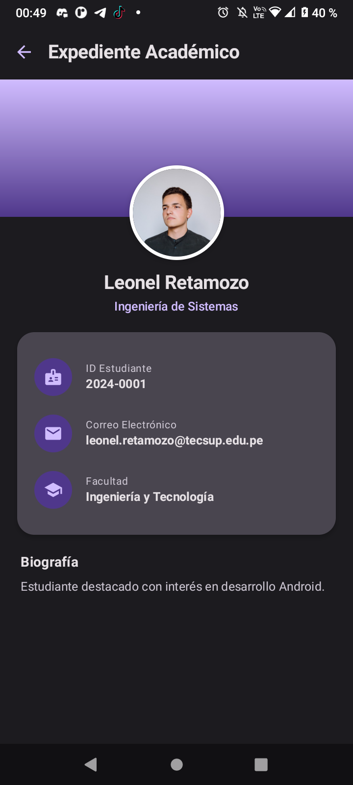
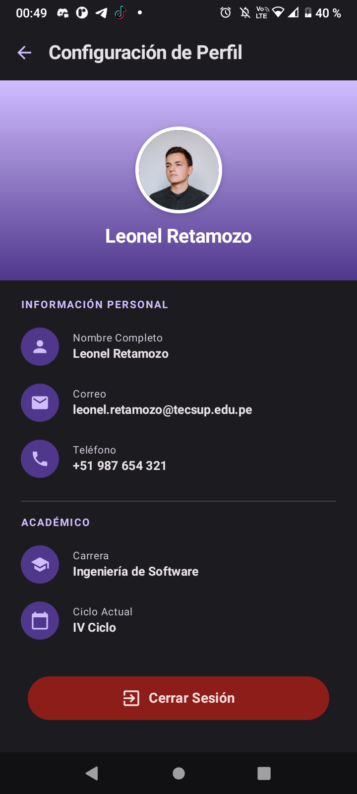

# Portal Académico 🎓

Aplicación móvil desarrollada en **Android** utilizando **Jetpack Compose** y **Material 3**. La aplicación gestiona la interfaz académica para un estudiante, incluyendo autenticación, menú principal, directorio de alumnos, expediente académico y configuración de perfil.

---

## 📋 Prompt Utilizado

```text
Actúa como un desarrollador Android senior experto en Jetpack Compose y Material3.
Tienes control absoluto y todos los permisos para tomar las decisiones técnicas necesarias: elige tú los nombres de variables y la organización de archivos, sin pedirme confirmación en ningún paso. No te detengas a preguntar qué prefiero — genera la solución completa de una sola vez.

=====================================================
REQUISITO OBLIGATORIO: CERO ERRORES EN EL EDITOR
=====================================================
El código final NO debe mostrar NINGÚN subrayado rojo en Android Studio: sin "unresolved reference", sin imports faltantes, sin @Composable experimentales usados sin su @OptIn, sin parámetros mal nombrados o de tipo incorrecto.

=====================================================
BUG CRÍTICO A CORREGIR (PRIORIDAD MÁXIMA)
=====================================================
En la versión anterior, al navegar a "Directorio de Alumnos" o a "Perfil", LA PANTALLA LLEGA A MOSTRARSE BREVEMENTE Y LUEGO LA APP SE CIERRA SOLA (crash justo después de renderizar, no antes). Revisa LaunchedEffect, carga de imágenes (AsyncImage/Coil), remember con tipo no serializable, o argumentos de navegación nulos.

=====================================================
FIDELIDAD VISUAL & ESTILO MATERIAL 3
=====================================================
1. ALINEACIÓN:
   - Login: Título "Portal Académico" y subtítulo "Accede a tu cuenta" CENTRADOS.
   - Home: Saludo "Bienvenido, Leonel" y subtítulo CENTRADOS.
   - TopAppBar: Títulos alineados a la IZQUIERDA junto al ícono de volver.
   - Cards y filas (InfoRow): Alineadas a la IZQUIERDA.

2. COLOR (Tokens Material 3):
   - MaterialTheme.colorScheme.primary -> Títulos, botones principales, textos destacados.
   - MaterialTheme.colorScheme.primaryContainer -> Degradados superiores e íconos en contenedores circulares.
   - MaterialTheme.colorScheme.surfaceVariant -> Fondo de tarjetas del directorio de alumnos.
   - MaterialTheme.colorScheme.errorContainer / onErrorContainer -> Botón "Cerrar Sesión" en perfil (fondo rosa claro, texto/ícono rojo oscuro).

3. ESTRUCTURA DE PANTALLAS:
   - Directorio de Alumnos: LazyColumn de StudentCards individuales (16dp bordes redondeados, elevación sutil).
   - Expediente Académico: ProfileBanner (banner morado + foto superpuesta) + Nombre/Carrera centrados abajo en fondo claro + Card agrupando ID, Correo y Facultad + Biografía fuera de la Card.
   - Configuración de Perfil: ProfileBannerWithName (banner alto con foto Y nombre en blanco DENTRO del banner) + filas directo sobre el fondo claro sin Card + botón final de cierre de sesión cápsula/pill (errorContainer).

=====================================================
PANTALLAS Y DATOS
=====================================================
- Login: Card centrada, Correo Institucional, Contraseña con toggle de visibilidad.
- Home: Bienvenida a "Leonel", menú con tarjetas "Directorio de Alumnos" y "Mi Perfil Académico".
- Directorio de Alumnos: 5 alumnos (Leonel Retamozo, María García, Carlos Perez, Ana Lopez, Luis Ramirez).
- Expediente Académico: Leonel Retamozo (ID 2024-0001, leonel.retamozo@tecsup.edu.pe, Ingeniería y Tecnología, Biografía).
- Configuración de Perfil: Leonel Retamozo (Correo leonel.retamozo@tecsup.edu.pe, Teléfono +51 987 654 321, Carrera Ingeniería de Software, IV Ciclo).
```

---

## 🔍 Solución del Bug Crítico de Crash

### Diagnóstico Técnico
- **Síntoma:** La pantalla se mostraba durante un instante (~100ms) y la app colapsaba inmediatamente después.
- **Causa Raíz:** `AsyncImage` (Coil) iniciaba la descarga asíncrona de las fotos de perfil desde internet (`https://images.unsplash.com/...`) inmediatamente después del primer frame de renderizado. Como `AndroidManifest.xml` no declaraba el permiso de internet, el SO lanzaba una `SecurityException: Permission denied (missing INTERNET permission)` en el hilo de red/corrutina.

### Correcciones Aplicadas
1. **Inclusión de Permisos:** Se agregaron `<uses-permission android:name="android.permission.INTERNET" />` y `ACCESS_NETWORK_STATE` en `AndroidManifest.xml`.
2. **Carga Resiliente de Imágenes:** `AsyncImage` en `ProfileBanner`, `ProfileBannerWithName` y `StudentCard` incluye `placeholder` y `error` usando `rememberVectorPainter(Icons.Default.Person)` para prevenir cierres ante problemas de red.
3. **Búsqueda Segura:** `StudentData.getStudentById(id)` implementa fallback seguro ante IDs no encontrados.

---

## 📸 Sección de Capturas de Pantalla

| Pantalla 1: Login | Pantalla 2: Home | Pantalla 3: Directorio de Alumnos |
| :---: | :---: | :---: |
|  |  |  |

| Pantalla 4: Expediente Académico | Pantalla 5: Configuración de Perfil |
| :---: | :---: |
|  |  |

---

## 🛠️ Estructura del Código

```
app/src/main/
├── AndroidManifest.xml (Permisos INTERNET)
└── java/com/retamozo/portalacademico/
    ├── MainActivity.kt
    ├── components/
    │   ├── InfoRow.kt
    │   ├── MenuOptionCard.kt
    │   ├── ProfileBanner.kt
    │   ├── ProfileBannerWithName.kt
    │   └── StudentCard.kt
    ├── model/
    │   └── Alumno.kt
    ├── navigation/
    │   ├── AppNavigation.kt
    │   └── Screen.kt
    ├── screens/
    │   ├── DetailScreen.kt
    │   ├── HomeScreen.kt
    │   ├── ListScreen.kt
    │   ├── LoginScreen.kt
    │   └── ProfileScreen.kt
    └── ui/theme/
        ├── Color.kt
        └── Theme.kt
```

---

## 🚀 Requisitos Técnicos
- **Android Studio**: Ladybug / Jellyfish o posterior.
- **Kotlin**: 2.2.10+
- **Min SDK**: 24 (Android 7.0 Nougat)
- **Target SDK**: 37 (Android 15 / 16)
